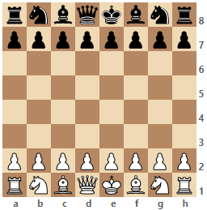

<h1 align="center">ii-react-chessboard</h1>

<h3 align="center">

Customizable React chessboard component

</h3>

<p align="center">
    
    <a href="https://ildar-icoosoft.github.io/react-chessboard/">
        
    </a>
    <a href="https://codecov.io/gh/ildar-icoosoft/react-chessboard">
        
    </a>
    <a href="https://github.com/semantic-release/semantic-release">
        
    </a>
    <a href="https://www.npmjs.com/package/ii-react-chessboard">
        
    </a>
</p>

ii-react-chessboard is a React component with a flexible "just a board" API. 
It's compatible with touch as well as standard HTML5 drag and drop.

<div align="center">


</div>

- Usage
  - [Installation](#installation)
  - [Example](#example)
- API
  - [useCombinedRefs](#usecombinedrefs)
  - [usePrevious](#useprevious)
  - [usePreviousDifferent](#usepreviousdifferent)
  - [useShallowEqualSelector](#useshallowequalselector)
  - [useDeepEqualSelector](#usedeepequalselector)

## Usage

### Installation

```
npm install ii-react-chessboard
```

### Example

```JSX
import { Board } from "ii-react-chessboard";

function App() {
  return (
    <Board position="startpos" />
  );
}
```

The code above will render chessboard with starting position:



For more examples please visit our [Storybook](https://ildar-icoosoft.github.io/react-chessboard/) page

## API

### Board

| Name | Type | Default | Description |
| --- | --- | --- | ---|
| position | Position | {} | The position to display on the board. It might be "startpos" string or Position object |
| orientation | PieceColor| "white" | Orientation of the board |
| draggable | boolean| false | If false, the pieces will not be draggable |
| width | number | 480 | The width in pixels |
| allowDrag | (pieceCode: PieceCode, coordinates: string) => boolean | undefined | A function to call when a piece drag is initiated. Returns true if the piece is draggable, false if not |
| showNotation | boolean | true | If false, notation will not be shown on the board |
| squareCssClasses | SquareCssClasses |  | An object containing CSS classes for squares. For example {'e4': "highlight", 'd4': "red"} |
| transitionDuration | number | 300 | The time it takes for a piece to slide to the target square |
| dragStartCssClass | string[] \| string|  | The class for the square which has a dragged piece |
| dragEnterSquareCssClass| string[] \| string|  | The class for the square which a piece is dragged over |
| onSquareClick | (coordinates: string) => void |  | A function to call when a square is clicked |
| onSquareRightClick| (coordinates: string) => void |  | A function to call when a square is right clicked |
| onDragStart | (event: PieceDragStartEvent) => void |  | A function to call when a piece is started to drag |
| onDragEnterSquare | (coordinates: string) => void |  | A function to call when a piece is dragged over a specific square |
| onDrop | (event: BoardDropEvent) => void |  | The logic to be performed on piece drop |
| onMouseEnterSquare | (coordinates: string) => void |  | A function to call when the mouse is enter a square |
| onMouseLeaveSquare | (coordinates: string) => void |  | A function to call when the mouse has left the square |

